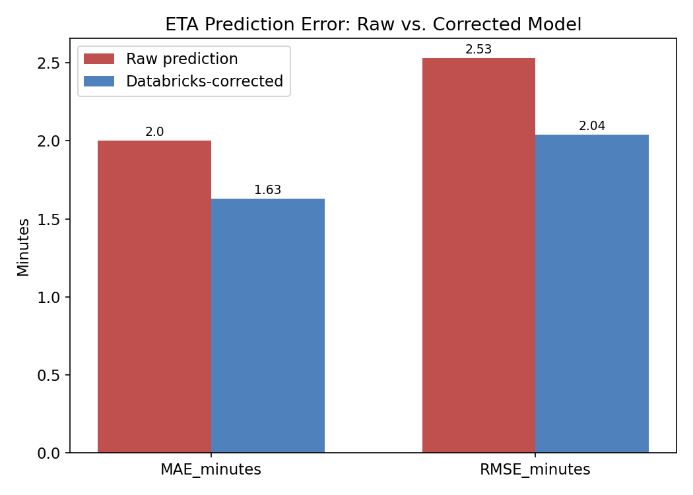
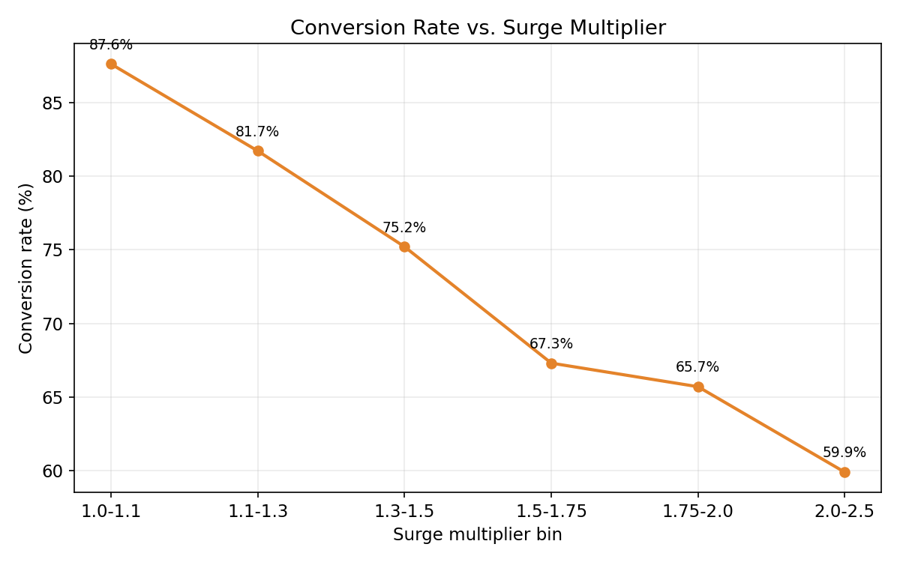
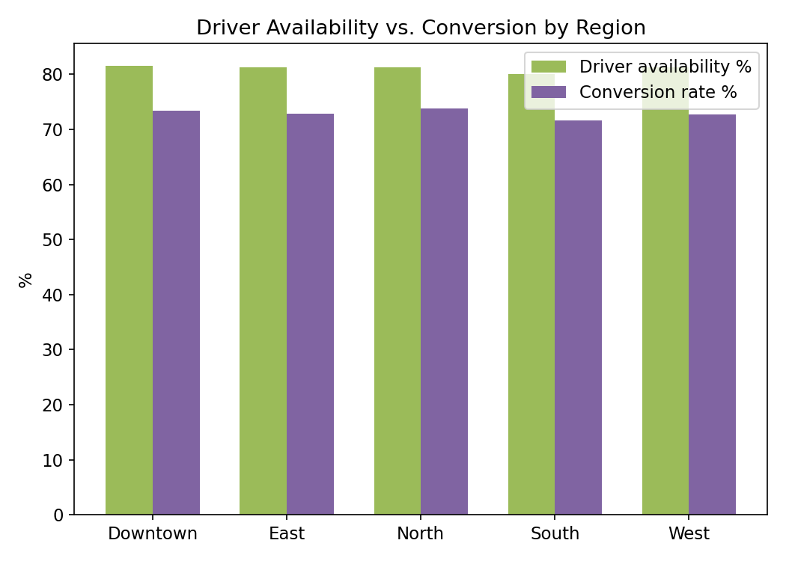

# Logistics ETA & Dynamic Pricing Analytics Platform

Real-time ETA prediction and surge-pricing analytics for a logistics marketplace, built to mirror how Uber/DoorDash-style platforms predict delivery times and adjust pricing on the request hot path, then expose the results to both engineering and business teams through a modern semantic-layer BI tool alongside a legacy one.

📊 [KPI Walkthrough (PDF)](docs/kpi_walkthrough.pdf) &nbsp;|&nbsp; 💻 [Source Code](src/) &nbsp;|&nbsp; ⚡ [Serving Layer (Go)](serving/main.go)

---

## KPI Snapshot

**ETA prediction error: raw model vs. Databricks-corrected model**



**Conversion rate vs. surge multiplier**



**Driver availability vs. conversion by region**



---

## Problem

A logistics platform needs to predict delivery ETAs and adjust pricing in real time on the request path, then give both engineering and business teams a way to monitor model performance and pricing outcomes without waiting on data eng for every new report.

## Data Source

Simulated trip request events (pickup distance, regional demand index, surge multiplier, predicted vs. actual ETA, conversion outcome), generated to mirror real peak-hour demand and congestion patterns. See `data/generate_synthetic_data.py`.

## What We're Testing For

Whether a lightweight correction model trained on regional demand and time-of-day context meaningfully improves ETA accuracy over the raw prediction, and whether surge pricing changes correlate with reduced conversion, the tradeoff a pricing engine has to balance against driver/dasher utilization.

## Stack

| Layer | Tool | Why |
|---|---|---|
| Feature engineering / ML | Databricks | Handles the streaming ingestion and ETA model training together (Bronze/Silver/Gold medallion) |
| Serving warehouse | BigQuery | Fast, cheap for the aggregated KPI queries Tableau and Omni run against |
| Real-time serving | Go | Sits on the request hot path (target p99 < 50ms); matches what logistics platforms actually use for dispatch/pricing services, not the analytics stack itself |
| Legacy/exec BI | Tableau | Existing exec-facing dashboard tooling |
| Self-serve BI | Omni | Semantic layer lets ops/business teams build their own views without duplicating metric logic |

## Task

Build the streaming ingestion and feature table, train the ETA correction model, implement the Go serving layer, and validate that Omni's semantic layer and Tableau produce identical KPI numbers off the same BigQuery views.

## Results

| Metric | Raw model | Corrected model |
|---|---|---|
| MAE (minutes) | 2.00 | 1.63 |
| RMSE (minutes) | 2.53 | 2.04 |

- Conversion rate drops from **87.6%** at low surge (1.0-1.1x) to **59.9%** at high surge (2.0-2.5x), a clear elasticity signal for the pricing engine to weigh against revenue.
- Driver availability holds steady around **80-82%** across regions; conversion tracks closely with it (~72-74%), suggesting utilization, not demand, is the binding constraint on conversion.

See `data/eta_metrics.csv`, `data/pricing_elasticity.csv`, and `data/utilization_by_region.csv` for full output.

## Repo Structure

```
data/       synthetic data generator + trip events + computed KPI CSVs
src/        Databricks feature engineering (production-target), ETA model, BigQuery views
serving/    Go real-time ETA/pricing quote service
charts/     KPI snapshot chart generator + output PNGs
docs/       KPI walkthrough deck (PPTX + PDF)
```
